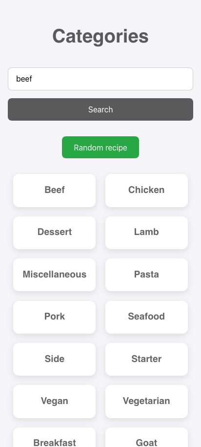
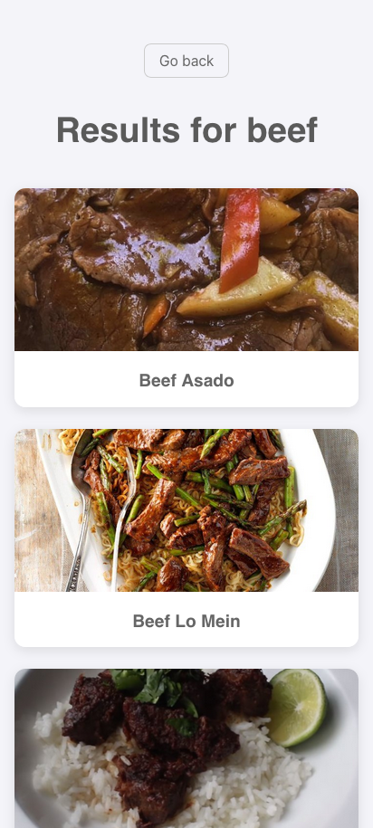
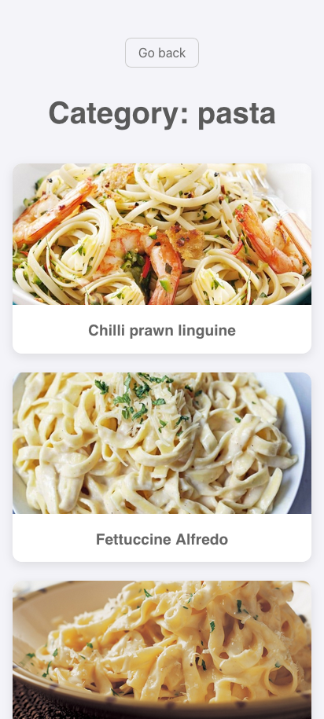

# Web App de Recetas

Una aplicación web interactiva de recetas que permite a los usuarios explorar comidas por categorías, buscar comidas por nombre y descubrir recetas al azar. Se realizó para refrescar los conocimientos en React.js.

**Capturas de pantalla**

**Características**

- **Exploración de categorías**: navega por diferentes categorías de comidas.
- **Búsqueda de recetas**: encuentra recetas específicas por su nombre.
- **Receta aleatoria**: descubre nuevas recetas con un solo clic.
- **Detalles de la receta**: accede a los ingredientes, instrucciones e incluso un enlace a un video de YouTube.
- **Diseño responsivo**: la interfaz se adapta a diferentes tamaños de pantalla (escritorio y móvil).

**Tecnologías utilizadas**

- **Front-end**: React, TypeScript, CSS.
- **Herramientas**: Vite, ESLint, Prettier.
- **Librerías**: React Router.
- **API**: TheMealDB (API externa de recetas).

**Instalación y uso**

1. Clona este repositorio:
   `git clone https://github.com/sergio2213/react-meals.git`
2. Navega a la carpeta del proyecto:
   `cd react-meals`
3. Instala las dependencias:
   `npm install`
4. Inicia la aplicación en modo de desarrollo:
   `npm run dev`
